## 준비 사항

Python 3.10.11 기준

[Azure Functions 핵심 도구 설치](https://learn.microsoft.com/ko-kr/azure/azure-functions/functions-run-local?tabs=windows%2Cisolated-process%2Cnode-v4%2Cpython-v2%2Chttp-trigger%2Ccontainer-apps&pivots=programming-language-python)

vscode 의 azure function extension 설치

**폴더 구조**

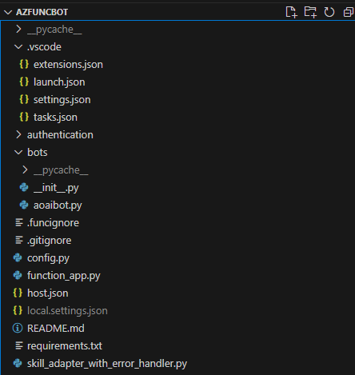


local.settings.json 파일을 생성
```
{
  "IsEncrypted": false,
  "Values": {
    "AzureWebJobsStorage": "UseDevelopmentStorage=true",
    "FUNCTIONS_WORKER_RUNTIME": "python",
    "AzureWebJobsFeatureFlags": "EnableWorkerIndexing",

    "MicrosoftAppId": "<azure bot 의 appId>",
    "MicrosoftAppPassword": "<Entra ID 의 앱등록에서 설정한 azure bot 의 secret>",
    "AZURE_OPENAI_KEY": "<AZURE_OPENAI_KEY>",
    "AZURE_OPENAI_ENDPOINT": "https://<OpenAI이름>.openai.azure.com/",
    "AZURE_OPENAI_VERSION": "2024-02-15-preview",
    "APPLICATIONINSIGHTS_CONNECTION_STRING": "<APPLICATIONINSIGHTS_CONNECTION_STRING>"
  }
}
```

예시

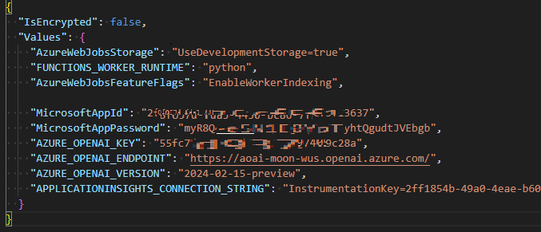

pip를 이용해 필요한 패키지를 설치

## vscode 디버깅
local.settings.json 파일을 정상적으로 생성하였다면 F5 키를 이용해 디버깅 시작.
정상적으로 실행되면 다음과 같이 2개의 api가 노출
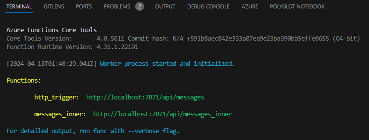


## bot emulator 에서 확인
로컬에서 실행할 때는 7071 포트가 기본으로 사용되므로 Bot URL 에 http://localhost:7071/api/messages 입력, App ID 와 App Password 넣고 Connect
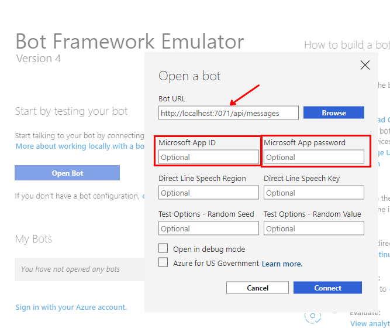

정상적으로 접속되는지 확인, 우측 하단에 POST 200 이 나와야 정상 접속이 된 상태.

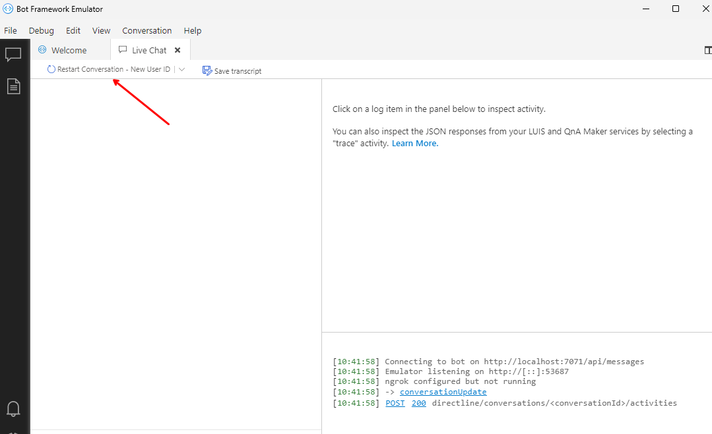

테스트를 위해 hello 입력

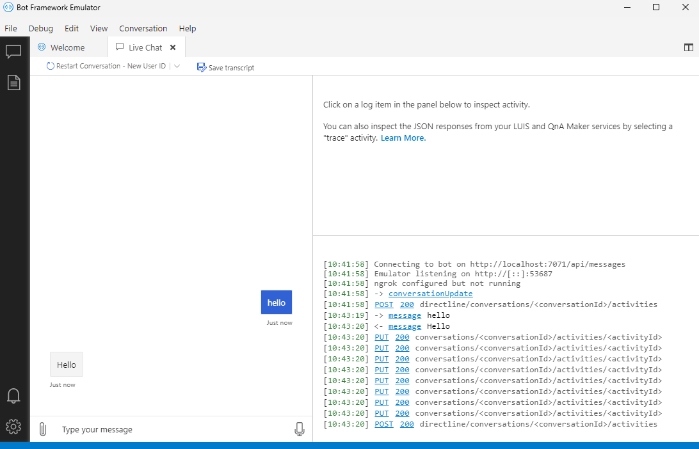
요청에 대해 stream 응답 구현이 되기 위해서 POST, PUT, PUT, ... 과 같이 응답이 오는지 확인(에뮬레이터에서는 PUT 에 대한 결과가 반영되지 않음)

## ngrok
[ngrok](https://ngrok.com/) 에서 google 계정으로 로그인하고 ngrok 을 다운로드 후 실행한 뒤

[authtoken 설정 및 실행](https://dashboard.ngrok.com/get-started/setup/windows)

포트는 7071을 사용하므로 다음 명령을 통해 실행
```
ngrok http http://localhost:7071   
```

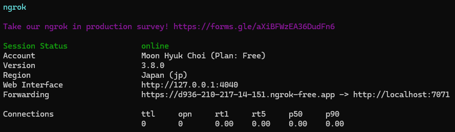

위 https 주소를 복사하여 Azure Bot 의 Configuration의 endpoint 에 넣고 하단에 Apply(적용)

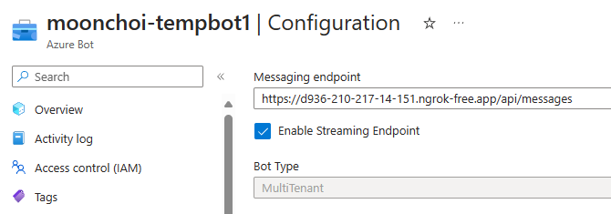

## Teams 에서 확인
Azure Portal 의 Azure Bot 에서 Channels 에서 Teams 를 추가 한 후 Open in Teams 링크를 클릭하여 Teams 실행

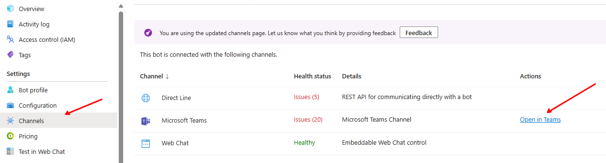


hello 라고 입력하면 다음처럼 보이며
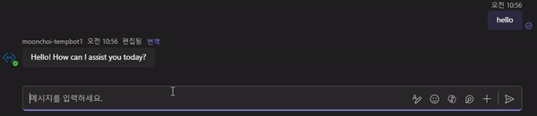


vscode 의 터미널창에는 다음과 같이 보여짐.

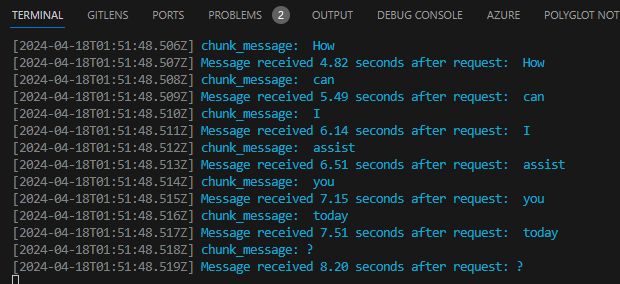

## Function App 에 배포시
local.settings.json 의 내용을 Configuration 의 Environment Variables 에 등록 필요.

# 2024-05-07 application insight 추가
요청에 대한 구간별 응답시간을 확인하기위해 application insights 를 추가 하면 다음과 같이 구간별 상세 시간을 추적할수있음.
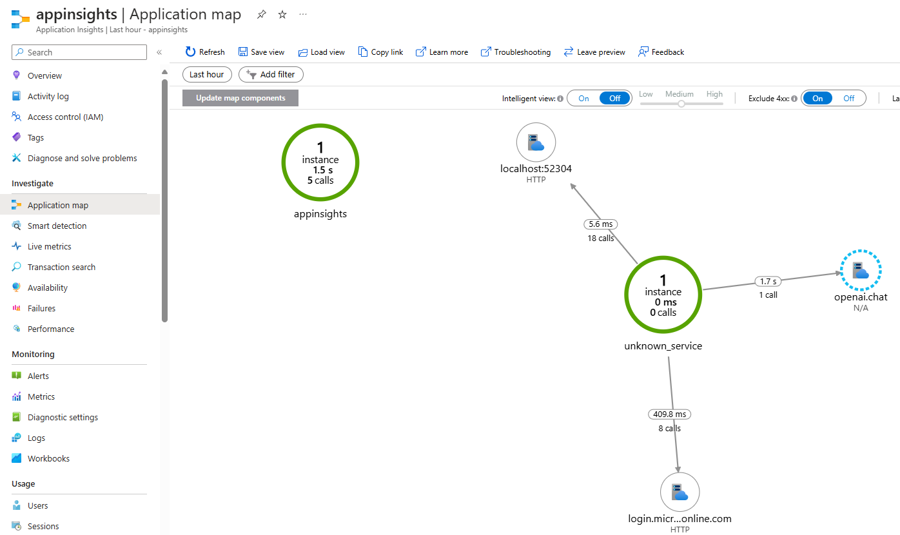

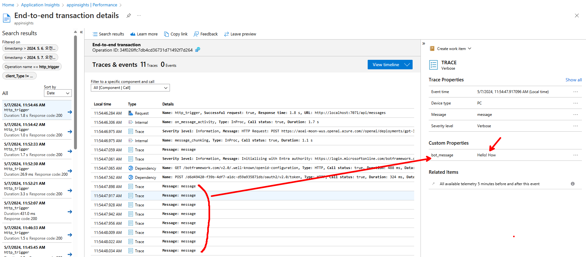

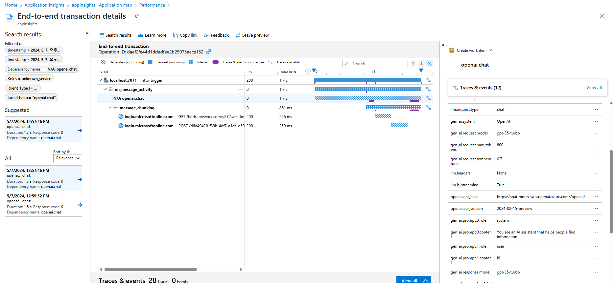

## 요청 추적 
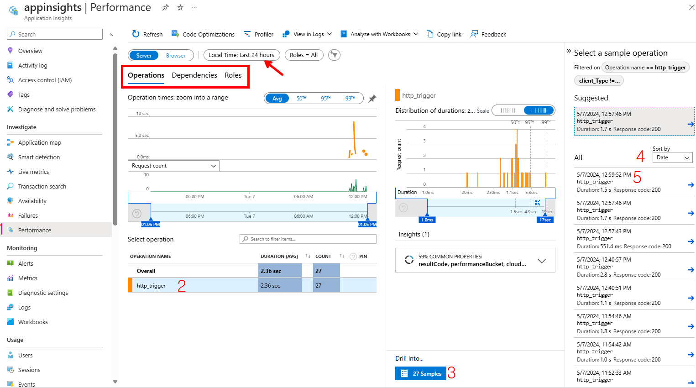
Bot Emulator나 Teams 에서 메시지 테스트 후 약 30초 이후 기록되는 이벤트를 추적하기 위해서
Performance 선택 후, http_trigger 선택, Samples 버튼 선택, 정렬을 날짜 기준으로 변경 후, 가장 상위(마지막) 요청에 대해 확인

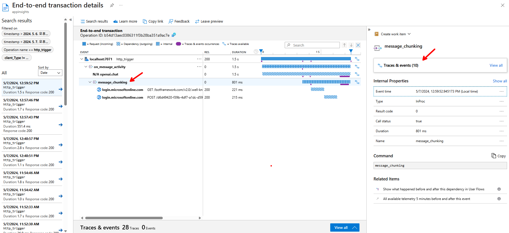
message_chunking 이벤트를 선택하고 우측 `Traces & events` 클릭 시 다음처럼 시간순으로 어떤 이벤트가 발생되었는지 Dependency와 함께 상세 정보 확인 가능

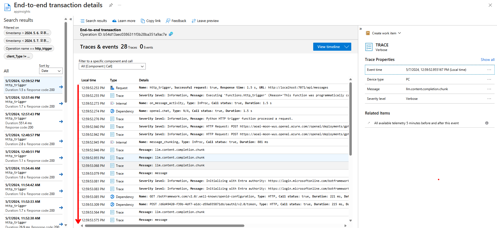